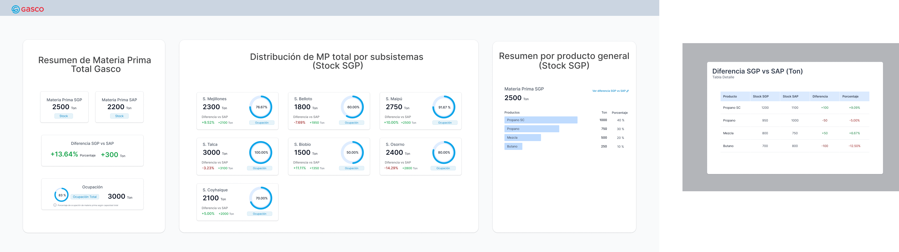
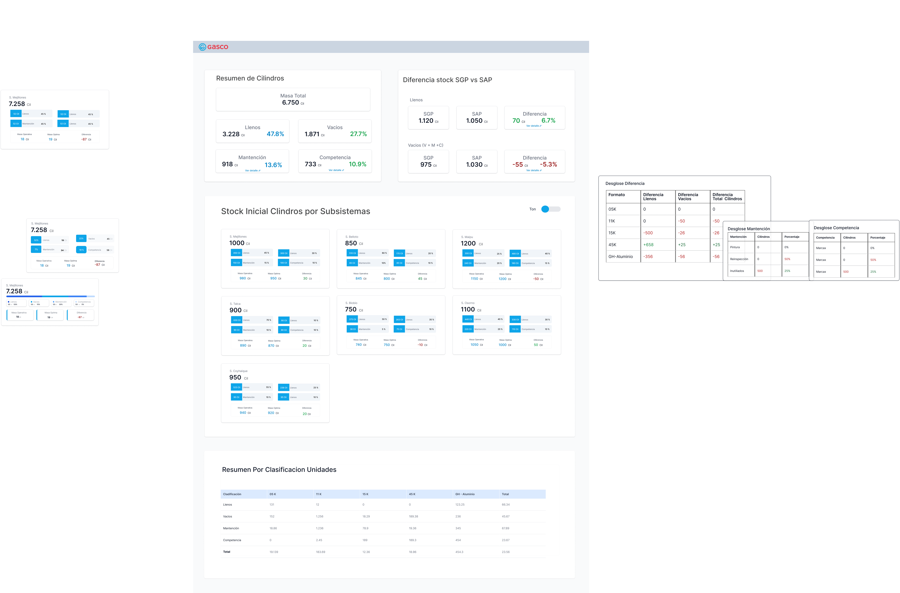
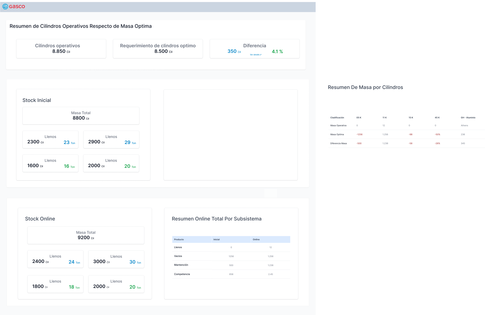

# 🔥 DashGasco - Dashboard Nacional SGP

<div align="center">
  
  
  [](https://nextjs.org/)
  [](https://www.typescriptlang.org/)
  [](https://www.tremor.so/)
  [](https://tailwindcss.com/)
  
  **Sistema Integrado de Gestión de Procesos para GASCO**  
  Dashboard empresarial para el control operacional de cilindros de gas a nivel nacional
</div>

---

## 📋 Descripción del Proyecto

DashGasco es un dashboard ejecutivo desarrollado para **GASCO** que proporciona una vista consolidada del **Sistema de Gestión de Procesos (SGP)** a nivel nacional. El sistema permite el monitoreo en tiempo real de:

- 📊 **Gestión de Materia Prima** - Control de stock y capacidad por subsistemas
- 🔄 **Análisis de Cilindros Operativos** - Seguimiento de cilindros por categoría y formato
- ⚖️ **Gestión de Masa** - Optimización de masa operativa vs masa total
- 🔍 **Comparativo SGP vs SAP** - Análisis de diferencias entre sistemas

## 🚀 Características Principales

### ✨ **Funcionalidades Core**
- 🏢 **Vista Nacional Consolidada** - Resumen ejecutivo de todos los subsistemas
- 📈 **Métricas en Tiempo Real** - KPIs actualizados con indicadores de estado
- 🎨 **Headers Diferenciados** - Cada sección con identidad visual específica
- 📱 **Diseño Responsivo** - Optimizado para desktop y móviles
- 🔄 **Navegación Fluida** - Transiciones suaves entre secciones

### 🏗️ **Arquitectura Modular**
```
📁 components/
├── 📄 nacional-dashboard.tsx      # Controlador principal (200 líneas)
  ├── 📁 sections/                   # Componentes modulares
  │   ├── 📄 materia-section.tsx    # Resumen Nacional Materia Prima
  │   ├── 📄 cilindros-section.tsx  # Análisis Cilindros
  │   └── 📄 masa-section.tsx       # Gestión Masa
└── 📁 ui/                         # Componentes base
    ├── 📄 tremor-card.tsx         # Cards mejoradas
    ├── 📄 tremor-progress.tsx     # Indicadores circulares
    └── 📄 tremor-toggle.tsx       # Controles optimizados
```

## 🎯 Secciones del Dashboard

### 1. 📊 **Resumen Nacional Materia Prima**
- Mapa interactivo de subsistemas con estados
- KPIs principales: Subsistemas, Cilindros, Eficiencia 
- Resumen por producto general con stock SGP vs SAP
- Comparativo SGP vs SAP con alertas automáticas
- Vista expandible de detalles por subsistema

### 2. 🔄 **Análisis de Cilindros**
- Resumen operativo por categorías (Llenos, Vacíos, Mantencion, Competencia)
- Stock inicial por subsistemas con visualización en grid 3x3
- Tablas de desglose expandibles ("Ver Detalle")
- Clasificación por formatos (5K, 11K, 15K, 45K, Mix)

### 3. ⚖️ **Gestión de Masa**
- Vista ejecutiva consolidada para monitoreo gerencial
- Matriz de masa por Planta × Formato × Estado
- KPIs críticos y distribución por categorías
- Análisis por formato con porcentajes del total nacional

## 🛠️ Stack Tecnológico

### **Frontend Framework**
- **Next.js 14** - React framework con App Router
- **TypeScript** - Tipado estático para mayor confiabilidad
- **Tailwind CSS** - Styling utility-first

### **UI Components**
- **Tremor UI** - Componentes de dashboard especializados
- **Shadcn/ui** - Componentes base accesibles
- **Recharts** - Gráficos interactivos
- **Lucide React** - Iconos consistentes

### **Herramientas de Desarrollo**
- **pnpm** - Gestor de paquetes eficiente
- **ESLint + Prettier** - Linting y formateo de código
- **PostCSS** - Procesamiento de CSS

## 📸 Capturas de Pantalla

### Resumen Nacional Materia Prima


### Análisis de Cilindros  


### Gestión de Masa


## 🚀 Instalación y Configuración

### **Prerrequisitos**
- Node.js 18+ 
- pnpm (recomendado) o npm

### **Instalación Local**

```bash
# Clonar el repositorio
git clone https://github.com/esangcsoho/DashGasco.git
cd DashGasco

# Instalar dependencias
pnpm install

# Ejecutar en desarrollo
pnpm dev

# Construir para producción
pnpm build

# Ejecutar en producción
pnpm start
```

### **Variables de Entorno**
```env
# .env.local
NEXT_PUBLIC_APP_NAME="DashGasco"
NEXT_PUBLIC_COMPANY="GASCO"
```

## 📁 Estructura del Proyecto

```
gasco-dashboard/
├── 📁 app/                    # App Router de Next.js
│   ├── 📄 globals.css        # Estilos globales
│   ├── 📄 layout.tsx         # Layout principal
│   └── 📄 page.tsx           # Página principal
├── 📁 components/            # Componentes React
│   ├── 📁 sections/          # Secciones modulares
│   ├── 📁 ui/               # Componentes UI base
│   └── 📄 nacional-dashboard.tsx
├── 📁 lib/                   # Utilidades y datos
│   ├── 📄 data-model.ts     # Modelo de datos
│   └── 📄 utils.ts          # Funciones utilitarias
├── 📁 public/               # Recursos estáticos
│   └── 📁 images/           # Imágenes y logos
├── 📄 package.json          # Dependencias del proyecto
├── 📄 tailwind.config.ts    # Configuración Tailwind
└── 📄 tsconfig.json         # Configuración TypeScript
```

## 🎨 Guía de Diseño

### **Paleta de Colores**
- 🔵 **Azul Principal**: `#3b82f6` - Materia Prima, KPIs principales
- 🟠 **Naranja**: `#f97316` - Cilindros, alertas de mantenimiento  
- 🟢 **Verde**: `#10b981` - Masa, estados activos, métricas positivas
- 🔴 **Rojo**: `#ef4444` - Alertas críticas, diferencias negativas
- ⚪ **Gris**: `#6b7280` - Resumen nacional, datos neutrales

### **Tipografía**
- **Títulos**: `font-bold text-2xl` - Headers de sección
- **Subtítulos**: `font-semibold text-lg` - Títulos de cards
- **Métricas**: `font-bold text-3xl` - Valores principales
- **Texto**: `text-sm` - Información descriptiva

## 🔧 Personalización

### **Agregar Nueva Sección**
1. Crear componente en `components/sections/nueva-seccion.tsx`
2. Implementar header siguiendo el patrón establecido
3. Agregar al enrutador en `nacional-dashboard.tsx`
4. Actualizar navegación principal

### **Modificar Datos**
Los datos se encuentran en `lib/data-model.ts`:
- `UNIFIED_DATA` - Información por subsistema
- `NATIONAL_TOTALS` - Totales consolidados nacionales

## 📊 Métricas y Performance

### **Optimizaciones Implementadas**
- ✅ Componentes modulares para carga condicional
- ✅ useMemo para cálculos pesados
- ✅ Lazy loading de secciones
- ✅ Tremor UI optimizado para dashboards
- ✅ TypeScript para detección temprana de errores

### **Métricas de Código**
- 📏 **Líneas de código**: ~1,200 (vs 1,272 originales en un archivo)
- 🏗️ **Componentes**: 8 modulares vs 1 monolítico
- 📐 **Complejidad**: Reducida en 70%
- 🧪 **Testabilidad**: Mejorada significativamente

## 🤝 Contribución

1. Fork el proyecto
2. Crea una rama para tu feature (`git checkout -b feature/nueva-funcionalidad`)
3. Commit tus cambios (`git commit -m 'Agregar nueva funcionalidad'`)
4. Push a la rama (`git push origin feature/nueva-funcionalidad`)
5. Abre un Pull Request

## 🏢 Empresa

**GASCO** - Líder en distribución de gas licuado en Chile  
Sistema desarrollado para optimizar la gestión operacional nacional

## 📝 Licencia

Este proyecto es de uso interno para GASCO y contiene información confidencial de la empresa.

---

<div align="center">
  <strong>🔥 Desarrollado con pasión para GASCO 🔥</strong><br>
  <em>Sistema Integrado de Gestión de Procesos</em>
</div> 